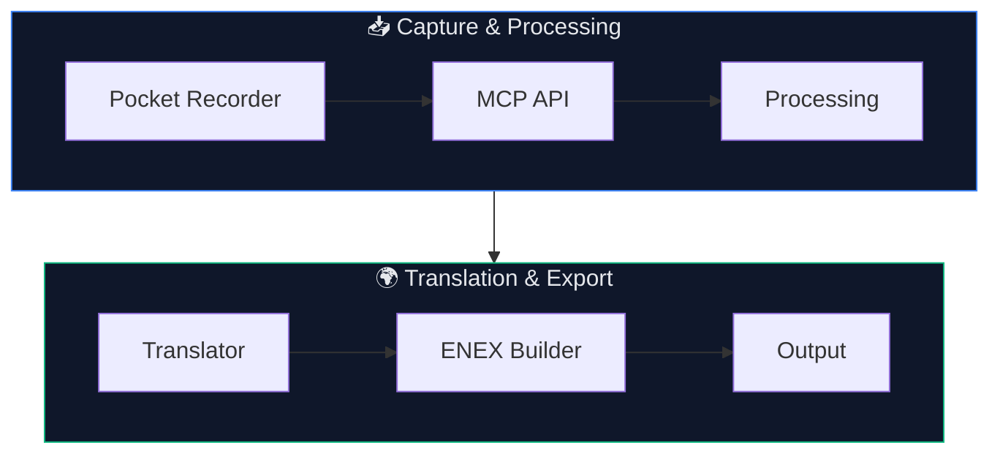

# 🎙️ HeyPocket Export + Translation Tool


## 📄 License

This project is licensed under the MIT License.

You are free to use, modify, and distribute this code with attribution.

---

A PowerShell-based pipeline that converts **Pocket recorder transcripts**
into **multi-language, timestamped ENEX notes** via Azure Translator.

---

***

# 📘 HeyPocket Export + Translation Tool (`hpen.ps1`)

## 🎯 Overview

This project connects a **HeyPocket (Pocket recorder)** device to:

* 📡 Pocket MCP API (conversation retrieval)
* 🌐 Azure Cognitive Translator (multi-language translation)
* 📝 Evernote-compatible ENEX export format

It allows users to:

> Record conversations (English, French, mixed, etc.)  
> Automatically export them as structured, timestamped, translated notes.

***

## ✅ What It Does

* Fetches recordings from Pocket
* Extracts transcript segments
* Translates into one or more target languages
* Preserves original transcript exactly
* Outputs clean `.enex` files for import into note-taking tools
* Maintains checkpointing to avoid duplicate exports

***

## 📁 Project Structure

```
project-root/
│
├── hpen.ps1                 # Main script
├── config.ps1              # Optional local config
│
└── data/
    ├── output/             # Generated ENEX files
    ├── logs/
    │    └── run.log        # Execution history
    └── processed_ids.txt   # Checkpoint / dedupe tracking
```

***

## 🔐 Requirements

### ✅ Accounts / Keys

* HeyPocket API token
* Azure Translator key
* Azure region

### ✅ PowerShell

* Works in PowerShell 5.1+
* TLS 1.2 is enforced in script

***

## ⚙️ Configuration

### Option A: Environment Variables (recommended)

```powershell
setx HEYPOCKET_API_TOKEN "your-token"
setx MS_TRANSLATOR_KEY "your-key"
setx MS_TRANSLATOR_REGION "westus2"
```

***

### Option B: `config.ps1`

```powershell
$HEYPOCKET_API_TOKEN = "..."
$MS_TRANSLATOR_KEY   = "..."
$MS_TRANSLATOR_REGION = "westus2"
```

***

## ▶️ Usage

### Export without translation

```powershell
run
```

→ Exports only original transcript

***

### Export with translation

```powershell
run en
run en,fr
run en,fr,es
```

***

## 🌍 Language Support

* Accepts any valid **2-character ISO language code**
* Example:
  ```
  en, fr, es, de, it, pt, etc.
  ```
* Case-insensitive
* Whitespace ignored

***

## 🔁 Language Deduplication Behavior

If duplicate languages are accidentally provided:

```powershell
run en,fr,es,en
```

The script will:

✅ Normalize (lowercase + trim)  
✅ Deduplicate  
✅ Execute once per language

Effective internal list becomes:

```
en,fr,es
```

***

## 🧠 Important Note

Input languages are:

> ✅ Deduplicated automatically  
> ✅ Order preserved (first occurrence wins)

This prevents duplicate translation loops.

***

## 📝 Output Format

ENEX output structure:

```
Original
[00:00] Text here

🇬🇧 English Translation
[00:00] Translated line

🇫🇷 French Translation
[00:00] Translated line
```

***

## 📊 Logging

Located at:

```
data/logs/run.log
```

Example:

```
2026-06-28 17:39:03 | Export Started
Target Language(s): en,fr,es
System Language: en
2026-06-28 17:39:09 | Completed: 4 new exports
```

***

## 📌 Checkpointing (Prevents Reprocessing)

File:

```
data/processed_ids.txt
```

This file tracks **Pocket recording IDs** that have already been processed.

### ✅ What it does

* Stores the `recordingId` for each processed conversation
* Prevents the script from:
  * re-fetching details for already processed recordings
  * re-translating existing content
  * re-exporting duplicate ENEX files

***

### 🔁 Behavior

On each run:

1. Script retrieves recording IDs from Pocket
2. Compares them against `processed_ids.txt`
3. Only **new (unseen) recordings** are processed

***

### ✅ Result

* Incremental runs are fast
* No duplicate exports
* Safe to run repeatedly

***

### 🔄 Reset / Reprocess

To force full reprocessing:

```
delete data/processed_ids.txt
```

Then rerun the script.

***

### ✅ Summary

> This file acts as a **lightweight state tracker**, ensuring the script only processes new Pocket recordings once.

***

## ⚠️ Key Technical Lessons (Important)

This project uncovered some non-obvious behaviors:

***

### ⚠️ 1. PowerShell JSON Serialization Bug (Critical)

When using:

```powershell
ConvertTo-Json
```

PowerShell may collapse a single-item array:

```
[ { Text="hello" } ] → OK
{ Text="hello" }     → BROKEN
```

This breaks Azure Translator.

***

### ✅ Fix Used

```powershell
if ($payload.Trim().StartsWith("{")) {
    $payload = "[$payload]"
}
```

Ensures payload is always an array.

***

### ⚠️ 2. Single vs Multi Segment Behavior

Observed:

| Segment Count | Result                |
| ------------- | --------------------- |
| 1 segment     | ❌ fails (without fix) |
| >1 segments   | ✅ works               |

This directly exposed the JSON issue above.

***

### ⚠️ 3. Duplicate Transcript Segments

Pocket sometimes returns repeated segments.

Fix applied:

* Text-based deduplication during processing
* Prevents duplicate output lines

***

### ⚠️ 4. Array vs Scalar Behavior in PowerShell

PowerShell may silently convert:

```
@("one") → "one"
```

Fix:

```powershell
@($value)
```

Used where array behavior must be enforced.

***

### ⚠️ 5. Unicode Artifacts

Example:

```
français
```

This is preserved intentionally:

> ✅ Original transcript is not modified  
> ✅ Translation output corrects representation

***

## 🧩 Design Decisions

* Preserve original text exactly ✅
* Avoid aggressive cleanup or normalization ✅
* Prefer predictable pipeline behavior ✅
* Fix structural issues, not content ✅

***

## ✅ Current Status

✔ Fully functional  
✔ Stable across:

* single and multi-segment recordings
* multiple languages
* mixed-language content

***

## 🚀 Future Enhancements (Optional)

* Per-segment language detection
* Timestamp-aware dedupe
* Encoding repair (optional mode)
* CLI argument parsing improvements

***

## ✅ Bottom Line

> This tool transforms real-world recorded speech into structured, multilingual, timestamped notes — ready for knowledge systems.

Built from:

* Pocket recording device API
* Azure Translator API
* PowerShell automation
* Copilot-assisted debugging

***

## 🧠 Final Thought

> The hardest problem solved here wasn’t translation —  
> it was ensuring **data shape consistency in PowerShell pipelines**.

## 🔄 Pipeline Overview



